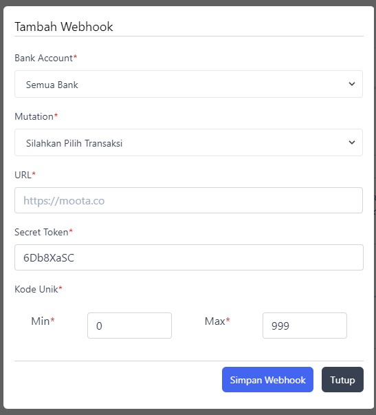

# Cek mutasi menggunakan Moota.co

## Persiapan

* akun Moota.co aktif
* akun Bank aktif

## Konfigurasi

1. Menambahkan akun bank ke Moota.co

    Link terkait :
    * <https://app.moota.co/bank>
    * <https://app.moota.co/bank/new>

1. *Generate Personal Access Token* untuk *credential* dari *API Request*

    Simpan token dengan aman. Perlu diketahui, saat dokumentasi ini dibuat, Moota.co hanya menampilkan token 1x yakni sesaat setelah pembuatan *Personal Token*. Jadi, ketika kita tidak menyimpannya saat itu juga, terpaksa kita harus *generate* token baru lagi

    Link terkait :
    * <https://app.moota.co/integrations/personal>

1. Siapkan *webhook* untuk mengirimkan notifikasi ke aplikasi / *endpoint API* kita ketika rekening bank pada Moota.co mendapatkan trigger ( terjadi mutasi akun bank )

    

    Catatan :
    * **Bank Account**, pilih akun bank yang ingin di-*listen* riwayat mutasinya
    * **Mutation**, pilih jenis mutasi yang ingin di-*listen*
    * **URL**, *endpoint API* kita untuk menerima kiriman data dari Moota.co
    * sisanya, biarkan *default*

    Link terkait :
    * <https://app.moota.co/integrations/webhook>

1. Siapkan *route* / *endpoint API* ( beserta fungsi untuk *handle* data yang dikirim oleh Moota.co ) pada aplikasi kita

Setelah melakukan konfigurasi diatas, maka sistem / aplikasi kita sudah terhubung dengan Moota.co dan siap menerima *webhook* dari Moota.co ketika terdapat mutasi pada bank yang didaftarkan.

## Penggunaan

Selain dari mutasi bank, kita juga bisa melakukan hal lain menggunakan API yang sudah disediakan oleh Moota.co, beberapa diantanya adalah :

1. Melihat profil pengguna ( <https://app.moota.co/api/v2/user> )
1. Melihat data akun bank terdaftar ( <https://app.moota.co/api/v2/bank> )
1. Menambahkan akun bank baru ( <https://app.moota.co/api/v2/bank/store> )
1. Melihat riwayat mutasi bank ( <https://app.moota.co/api/v2/mutation?type=&bank=&amount=&description=&note=&date=&start_date=&end_date=&page=> )
1. dll

Untuk informasi *endpoint API* yang disediakan oleh Moota.co, bisa akses ke link berikut : <https://app.moota.co/api/explorer>

Jangan lupa untuk menyisipkan *Personal Access Token* yang sudha didapat sebelumnya ( Konfigutas : langkah ke 2 ) sebagai credentials untuk mengakses *endpoint API*
