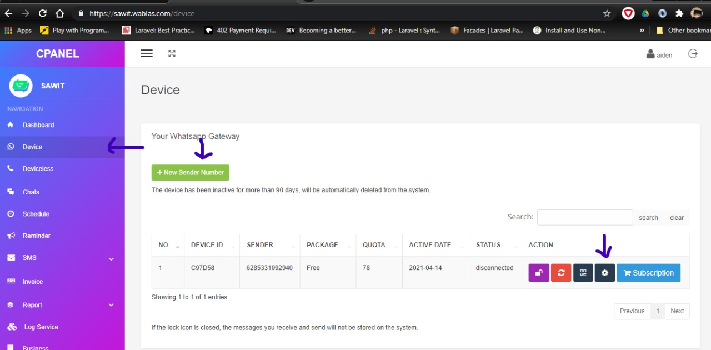
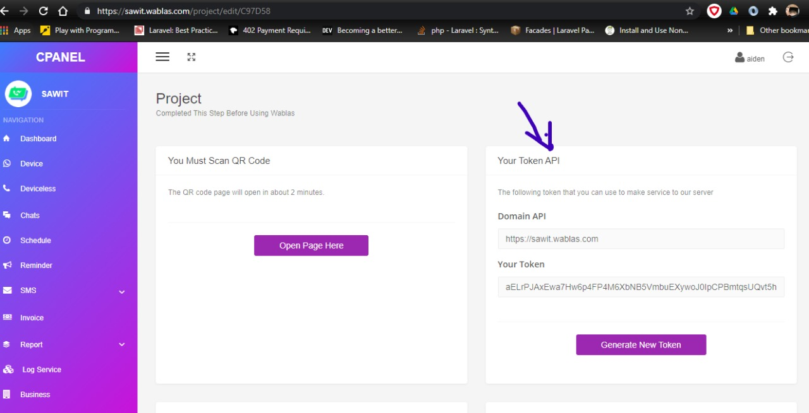

# Notifikasi melalui pesan WhatsApp

Notifikasi ini menggunakan pihak ketiga penyedia jasa API WhatsApp, yakni <https://wablas.com>

## Konfigurasi

1. Buat akun Wablas.com

1. Daftarkan nomor untuk *sender* / pengirim pesan whatsapp

1. Hubungkan WhatsApp-Web dari aplikasi WhatsApp ( mobile ) ke akun Wablas.com

    

1. *Generate* token untuk *credential endpoint API*

    

## Penggunaan

1. Kirim pesan melalui WhatsApp

    ```php
    use Illuminate\Support\Facades\Http;

    $sendMessage = Http::withHeaders([
            'Authorization' => env('WABLAS_TOKEN_KEY'),
            'Content-Type'  => 'application/json',
        ])
        ->post(env('WABLAS_SERVER_URL') . '/api/send-message', [
            'phone'   => $phoneReceiver,
            'message' => $message
    ]);
    ```

informasi lebih lanjut untuk dokumentasi endpoint API Wablas.com, dapat diakses ke : <https://wablas.com/documentation>
